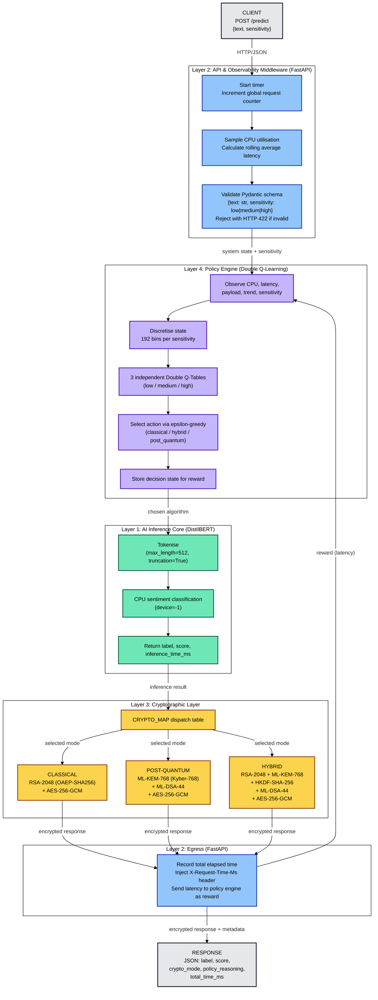
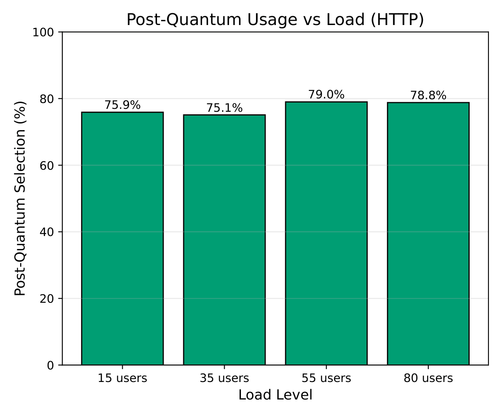
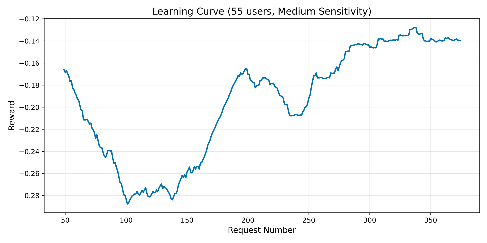
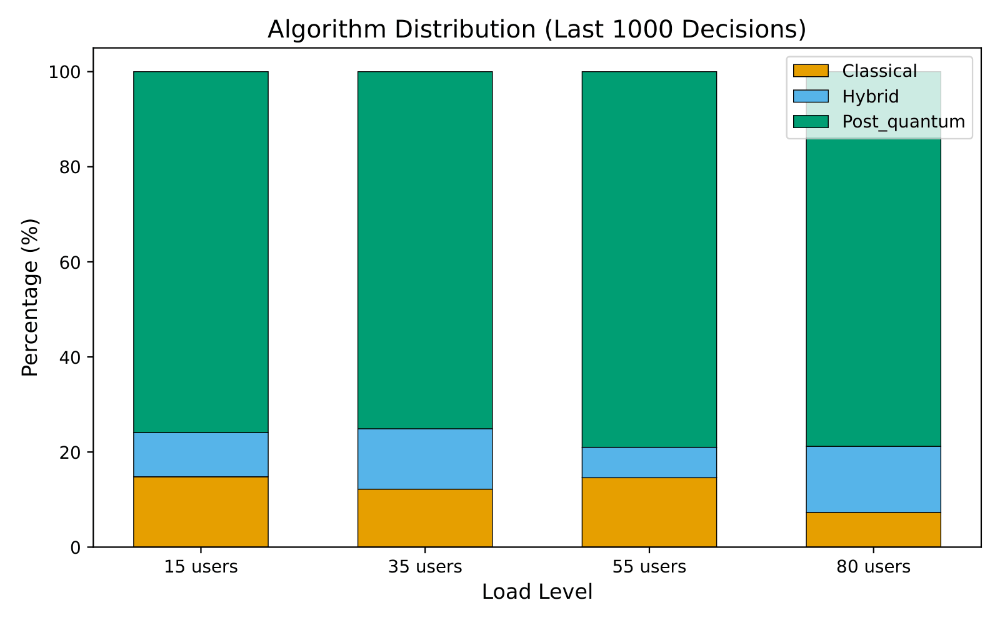
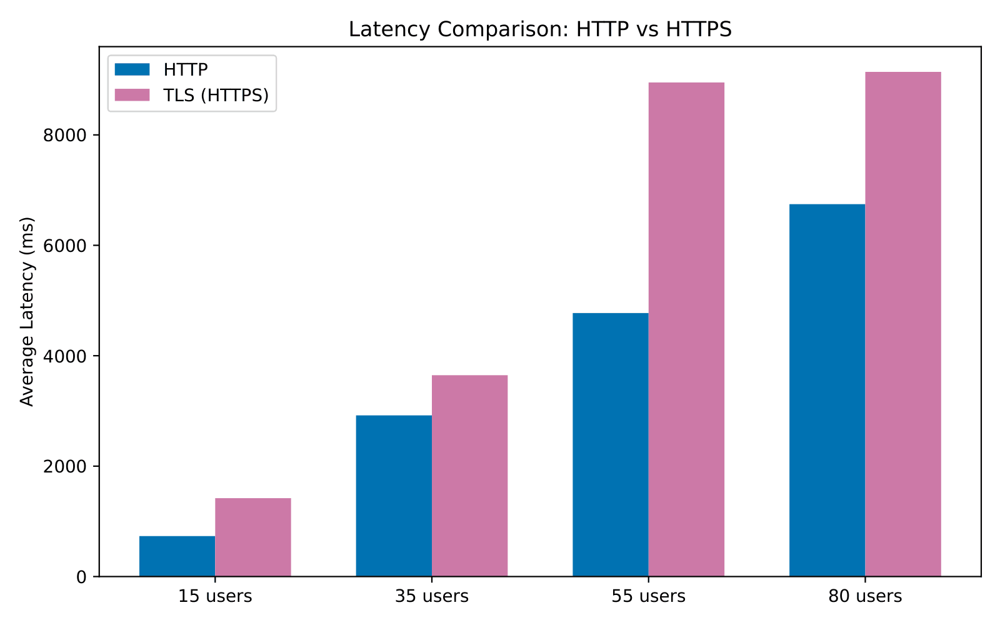

# Evaluation of Classical, Hybrid and Post-Quantum Cryptographic Mechanisms in AI-Based Web Services

The rapid development of quantum computing poses a significant challenge to current public-key cryptographic algorithms such as RSA and Elliptic Curve Cryptography (ECC). Quantum algorithms, particularly Shor's algorithm, have the potential to break these widely deployed cryptographic systems, giving rise to the "Harvest Now, Decrypt Later" threat, where encrypted data intercepted today could be decrypted once practical quantum computers become available. Although NIST-standardized Post-Quantum Cryptography (PQC) provides quantum-resistant alternatives such as ML-KEM and ML-DSA, these algorithms introduce larger key sizes and additional computational overhead, making their deployment difficult in latency-sensitive AI web services. 

This project presents PQC-AI, an adaptive cryptographic framework that dynamically selects between Classical, Post-Quantum, and Hybrid cryptographic mechanisms according to the current operating conditions of the system. Instead of relying on a fixed encryption policy, the framework evaluates request sensitivity, CPU utilization, rolling average latency, payload characteristics, and other runtime parameters to determine the most appropriate cryptographic mode for each request. This adaptive approach improves the balance between security and performance while maintaining compatibility with existing web infrastructures. 

The framework is implemented as a FastAPI-based REST service that integrates DistilBERT sentiment analysis with an adaptive cryptographic policy engine and interchangeable cryptographic modules. It supports Classical encryption using RSA-2048 and AES-256-GCM, Post-Quantum encryption using ML-KEM-768 and ML-DSA-44, and a Hybrid mode that combines both approaches. The system also provides REST API endpoints for encrypted inference, key distribution, policy statistics, system health monitoring, and performance metrics, enabling secure and flexible deployment in modern AI applications. 

Experimental evaluation demonstrates that the proposed framework maintains cryptographic overhead below 2.2 ms while successfully adapting its cryptographic decisions under varying workloads. Load testing and benchmarking show that the framework consistently prioritizes stronger protection for sensitive requests while preserving system performance. The results also indicate that AI inference remains the dominant source of latency rather than the cryptographic operations themselves, supporting the practicality of adaptive cryptography for real-time AI-based web services. 


## Table of contents

- [How it works](#how-it-works)
- [Architecture diagram](#architecture-diagram)
- [Cryptographic modes](#cryptographic-modes)
- [Policy engine](#policy-engine)
- [Project structure](#project-structure)
- [Requirements](#requirements)
- [Setup](#setup)
  - [Local](#local)
  - [Docker](#docker--tls)
- [API endpoints](#api-endpoints)
- [Benchmarking](#benchmarking)
- [Results summary](#results-summary)
- [Limitations](#limitations)
- [References](#references)

## How it works

Each request passes through four layers in order:

1. **API & Middleware (FastAPI)** – Validates the request, starts a timer, records CPU usage, and tracks rolling latency.
2. **Policy Engine (Double Q-learning)** – Observes the current system state and chooses one of three encryption modes: classical, hybrid, or post-quantum.
3. **AI Inference (DistilBERT)** – Performs sentiment analysis on the CPU. A GPU was intentionally not used, to simulate a resource-constrained deployment.
4. **Cryptographic Layer** – Encrypts the inference result using the encryption mode selected by the policy engine.

The response then travels back through the same layers in reverse. The measured end-to-end latency is used as the reward signal, which lets the Double Q-learning agent improve its future encryption decisions.

## Architecture diagram



If you're viewing this file somewhere that doesn't support Mermaid, the four-layer breakdown above under [How it works](#how-it-works) covers the same flow in text.

## Cryptographic modes

| Mode         | Algorithms                                                                             |
| ------------ | -------------------------------------------------------------------------------------- |
| Classical    | RSA-2048 (OAEP-SHA256) + AES-256-GCM                                                   |
| Hybrid       | RSA-2048 + ML-KEM-768, combined via HKDF-SHA-256, + AES-256-GCM, signed with ML-DSA-44 |
| Post-quantum | ML-KEM-768 (FIPS 203) + ML-DSA-44 (FIPS 204) + AES-256-GCM                             |

## Policy engine

- State space: 192 discrete system states per sensitivity level (4 CPU bins × 4 latency bins × 4 payload bins × 3 trend bins).
- Three independent Double Q-tables, one per sensitivity level (low, medium, high).
- ε-greedy exploration: starts at 0.30, decays by a factor of 0.999 per decision, floors at 0.05. Re-exploration kicks ε back up to 0.20 if the trailing 100-request reward drops more than one standard deviation below the mean.
- Experience replay: buffer size 5,000, batch size 32, retrained every 50 decisions.
- Reward function weighs security score, latency, and CPU load, with weights that shift by sensitivity level. High-sensitivity requests carry a −0.20 penalty for choosing a non-post-quantum mode and a dynamic security bonus that shrinks under load instead of a fixed constant.

Switching from a single shared Q-table to per-sensitivity Double Q-tables raised the post-quantum selection rate for high-sensitivity traffic from 54.5% to over 82%, and removed the cross-sensitivity interference that caused the original drop.

## Project structure

```
.
├── ai_model/                  # DistilBERT sentiment analysis
│   ├── classifier.py
│   └── test_classifier.py
│
├── api/                       # FastAPI application
│   ├── main.py
│   ├── schemas.py
│   └── e2e_client.py
│
├── crypto/                    # Cryptographic implementations
│   ├── classical.py
│   ├── hybrid.py
│   ├── post_quantum.py
│   └── benchmark_crypto.py
│
├── policy/                    # Double Q-learning policy engine
│   ├── engine.py
│   ├── qtable.py
│   ├── replay_buffer.py
│   └── monitor.py
│
├── benchmark/                 # Load testing (Locust) and results
│   ├── locustfile.py
│   ├── results/
│   └── results1/
│
├── plots/                     # Plot generation scripts
│   ├── generate_plots.py
│   └── generate_plots_tls.py
│
└── docker/                    # Docker configuration
    ├── Dockerfile
    ├── docker-compose.yml
    └── nginx/                 # TLS reverse proxy configuration
```

## Requirements

- Python 3.11
- CMake, a C build toolchain, and OpenSSL headers (needed to build liboqs)
- liboqs v0.15.0 and the liboqs-python binding v0.14.1
- Docker and Docker Compose, if you want to run the full stack with Nginx and Locust

Python packages used across the project:

```
fastapi
uvicorn
pydantic
psutil
transformers
torch
cryptography
oqs
numpy
pandas
matplotlib
locust
requests
pytest
```

Create a `requirements.txt` from this list (or `pip freeze` your working environment) before building the Docker image; the Dockerfile expects one at the repository root.

### Building liboqs

liboqs doesn't install via pip on its own. It's a C library, so you build it from source first, then install the Python binding on top of it.

```bash
# system packages needed to build it
sudo apt update
sudo apt install -y cmake gcc ninja-build libssl-dev python3-dev

# clone and build liboqs itself
git clone --branch 0.15.0 https://github.com/open-quantum-safe/liboqs.git
cmake -S liboqs -B liboqs/build -DBUILD_SHARED_LIBS=ON
cmake --build liboqs/build --parallel
sudo cmake --install liboqs/build

# refresh the linker cache so Python can find the shared library
sudo ldconfig

# install the Python binding
git clone --branch 0.14.1 https://github.com/open-quantum-safe/liboqs-python.git
pip install ./liboqs-python
```

On macOS, swap `apt install` for `brew install cmake ninja openssl` and skip `ldconfig`. On Windows, use the prebuilt liboqs binaries listed in the [liboqs README](https://github.com/open-quantum-safe/liboqs#installation) instead of building from source, which is considerably easier to install.

Verify it worked before moving on:

```bash
python -c "import oqs; print(oqs.get_enabled_kem_mechanisms())"
```

If that prints a list of KEM algorithm names instead of an import error, you're set.

## Setup

### Local

```bash
git clone https://github.com/nikitatosh/adaptive-pqc-framework.git
cd <repo>
python -m venv venv
source venv/bin/activate
pip install -r requirement.txt
uvicorn api.main:app --host 0.0.0.0 --port 8000 --reload
```

The first request triggers a DistilBERT download from Hugging Face. Warm it up ahead of time with:

```bash
python -c "from transformers import pipeline; pipeline('sentiment-analysis', model='distilbert-base-uncased-finetuned-sst-2-english', device=-1)"
```

### Docker & TLS

The Nginx container needs a TLS certificate and key at `docker/nginx/ssl/`. These aren't committed to the repository, so generate a self-signed pair before your first build:

```bash
mkdir -p docker/nginx/ssl
openssl req -x509 -nodes -days 365 -newkey rsa:2048 \
  -keyout docker/nginx/ssl/server.key \
  -out docker/nginx/ssl/server.crt \
  -subj "/CN=localhost"
```

Then build and start the stack:

```bash
cd docker
docker compose up --build
```

This starts three containers: the FastAPI service, an Nginx reverse proxy with the self-signed TLS certificate on ports 80/443, and a Locust instance on port 8089 pointed at the Nginx endpoint.

Note:The FastAPI service runs on port 8000 inside the Docker network and is not exposed to the host directly. All external traffic (HTTP on port 80 and HTTPS on port 443) is handled by the Nginx reverse proxy, which forwards requests to the FastAPI container over the internal network.

For a real deployment, replace the self-signed pair with a certificate from a trusted CA and keep both files out of version control.

## API endpoints

| Endpoint             | Method | Purpose                                                                                 |
| -------------------- | ------ | --------------------------------------------------------------------------------------- |
| `/predict`           | POST   | Plaintext inference; returns the sentiment result plus the crypto mode the policy chose |
| `/predict/encrypted` | POST   | Full end-to-end encrypted request and response, using client-side key encapsulation     |
| `/keys/{mode}`       | GET    | Returns server public keys for `classical`, `hybrid`, or `post_quantum`                 |
| `/health`            | GET    | Liveness check, model load status, current CPU and memory usage                         |
| `/metrics`           | GET    | Aggregate request count, average latency, algorithm distribution                        |
| `/policy/stats`      | GET    | Current policy engine state: distribution, epsilon, Q-table update counts               |
| `/policy/history`    | GET    | Time series of rewards, epsilon decay, and per-request decisions                        |

Example request:

```bash
curl -X POST http://localhost:8000/predict \
  -H "Content-Type: application/json" \
  -d '{"text": "This product works exactly as advertised.", "sensitivity": "high"}'
```

The end-to-end encrypted flow (`/predict/encrypted`) has a working reference client at `api/e2e_client.py`:

```bash
python api/e2e_client.py --host http://localhost:8000 --text "Great product!"
```

That endpoint is a demonstration of the encapsulation protocol. It encrypts the response under the server's own key pair rather than a registered client key, so treat it as a proof of concept, not a production-ready channel.

## Benchmarking

Isolated cryptographic microbenchmark (100 iterations, 63-byte payload):

```bash
python crypto/benchmark_crypto.py
```

Load testing with Locust, run against the live API:

```bash
locust -f benchmark/locustfile.py --host http://localhost:8000
```

`SentimentUser` mixes medium-sensitivity (weight 5), high-sensitivity (weight 2), and low-sensitivity (weight 1) requests. Test runs at 15, 35, 55, and 80 concurrent users are saved under `benchmark/results/` as CSV and JSON.

Regenerate the report figures from saved results:

```bash
python plots/generate_plots.py
python plots/generate_plots_tls.py
```

Output lands in `plots/output/paper/`. Update the hardcoded `BASE_PATH` in `generate_plots.py` to point at your own results directory before running it.

## Results summary

| Metric                                                         | Value                                          |
| -------------------------------------------------------------- | ---------------------------------------------- |
| Cryptographic overhead (all modes)                             | Under 2.2 ms                                   |
| Post-quantum selection rate                                    | Above 75% at every load level (15 to 80 users) |
| High-sensitivity PQ selection, single Q-table                  | 54.5%                                          |
| High-sensitivity PQ selection, per-sensitivity Double Q-tables | 82.8%                                          |
| RSA-2048 decryption (63-byte payload)                          | 1.836 ms mean                                  |
| ML-KEM-768 decryption (63-byte payload)                        | 0.298 ms mean                                  |

Full benchmark tables, learning curves, and load test breakdowns are in the accompanying manuscript.

### Adaptive Post-Quantum Selection

The policy engine consistently prioritizes post-quantum cryptography for high-sensitivity requests across different system loads.

<p align="center">

</p>

### Policy Learning

The Double Q-learning agent improves its policy over time based on the observed reward.

<p align="center">

</p>

### Encryption Mode Distribution

Distribution of Classical, Hybrid, and Post-Quantum selections across different load levels.

<p align="center">

</p>

### HTTP vs HTTPS Latency

Comparison of average request latency with and without TLS.

<p align="center">

</p>

## Limitations

- **CPU-bound inference.** DistilBERT runs on CPU only, by design. It's the main latency bottleneck, well above what encryption adds. A GPU backend or a lighter model like TinyBERT would help.
- **Demo-only key encapsulation.** `/predict/encrypted` encrypts its response with the server's own key pair, not a client-registered one. Shows the encapsulation flow correctly, but isn't production-ready end-to-end encryption.
- **Reward function isn't formally verified.** Weights and penalties were tuned to produce the results reported here, but there's no proof they hold for every state-action pair. Flagged as future work.

## References

- NIST FIPS 203 — Module-Lattice-Based Key-Encapsulation Mechanism Standard (ML-KEM)
- NIST FIPS 204 — Module-Lattice-Based Digital Signature Standard (ML-DSA)
- NIST SP 800-56C Rev. 2 — Key derivation via HKDF
- Sanh et al., 2019 — DistilBERT
- van Hasselt et al., 2016 — Double Q-learning
- [liboqs](https://github.com/open-quantum-safe/liboqs), Open Quantum Safe project

## Authors

This project was developed as a Final Year B.Tech project by Group 05, Section 2241004,  Department of Computer Science and Engineering, Siksha 'O' Anusandhan (Deemed to be) University.
Batch: 2022-2026 

## License

MIT. See [LICENSE](LICENSE).
